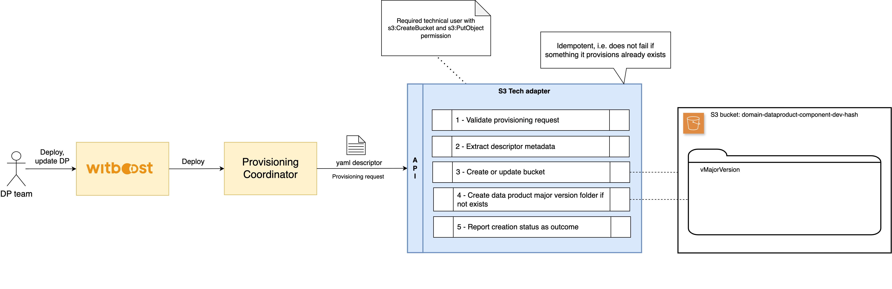
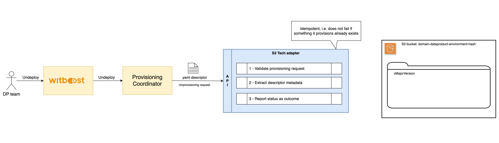

# High Level Design

This document describes the High Level Design of the ArgoCD Tech Adapter.
The source diagrams can be found and edited in the [accompanying draw.io file](hld.drawio).

- [Overview](#overview)
- [Provisioning](#provisioning)
- [Unprovisioning](#unprovisioning)

## Overview

### Tech Adapter

A Tech Adapter (TA) is a service in charge of performing a resource allocation task, usually
through a Cloud Provider. The resources to allocate are typically referred to as the _Component_, the
details of which are described in a YAML file, known as _Component Descriptor_.

The TA is invoked by an upstream service of the Witboost platform, namely the Coordinator, which is in charge of orchestrating the creation
of a complex infrastructure by coordinating several TAs in a single workflow. The TA receives
the _Data Product Descriptor_ as input with all the components (because it might need more context) plus the id of the component to provision, named _componentIdToProvision_

To enable the above orchestration a TA exposes an API made up of five main operations:
- validate: checks if the provided component descriptor is valid and reports any errors
- provision: allocates resources based on the previously validated descriptor; clients either receive an immediate response (synchronous) or a token to monitor the provisioning process (asynchronous)
- status: for asynchronous provisioning, provides the current status of a provisioning request using the provided token
- unprovision: destroys the resources previously allocated.
- updateacl: grants access to a specific component/resource to a list of users/groups

### S3 Tech Adapter

The **S3 Tech Adapter** provides integration with Amazon S3 to manage data provisioning operations. It focuses on the creation and organization of S3 buckets and component folders for a given Data Product (DP).

It offers:
- **Bucket Management**: Create or update S3 buckets.
- **Component Folder Management**: Organize Data Product components under structured folder hierarchies.

---

## Provisioning

This flow enables the creation and management of S3 buckets and folders linked to Data Product components.

#### - **Provisioning Request**
- A provisioning request is sent to the system by the **Provisioning Coordinator**.
- This request includes a YAML descriptor containing metadata required to configure the bucket and its component folders.

#### - **Request Validation**
- The **S3 Tech Adapter** validates the provisioning request to ensure that it includes the required fields.

#### - **Metadata Extraction**
- Metadata is extracted from the request descriptor to determine:
    - The **S3 bucket name** in the format: `domain-dataproduct-environment-hash`.
    - The **component folders** to be created within the bucket.

#### - **Bucket Creation**
- The **S3 Tech Adapter** creates or updates the specified bucket using the extracted metadata.

The following table describes the default values applied to S3 buckets during creation:

| **Configuration**            | **Default Value**                                           |
| ---------------------------- | ----------------------------------------------------------- |
| Bucket type                  | General purpose                                             |
| Object ownership             | ACLs disabled                                               |
| Block Public Access settings | Block all public access                                     |
| Bucket versioning            | Disabled                                                    |
| Encryption type              | Server-side encryption with Amazon S3 managed keys (SSE-S3) |
| Bucket key                   | Disabled                                                    |
| Object Lock                  | Disabled                                                    |

#### - **Component Folder Creation**
- Within the S3 bucket, folders are created for the Data Product's major versions.
- Folder creation ensures that the Data Product's major version structure is organized efficiently.

#### - **Operation Result Reporting**
- The final status of the provisioning process is reported as an outcome.
- It includes:
    - Success: Confirmation of bucket and folder creation.
    - Errors: Details of any issues encountered during the process.

---

### Requirements

- **Technical User**: A technical user with `s3:ListBucket`, `s3:CreateBucket` and `s3:PutObject` permissions is required to provision and manage S3 resources.

## Unprovisioning

This flow enables the removal of component folders within an S3 bucket without impacting the bucket or other components.

#### - **Unprovisioning Request**
- An unprovisioning request is sent to the system by the **Provisioning Coordinator**.
- This request includes a YAML descriptor containing metadata required to identify the folder for deletion.

#### - **Request Validation**
- The **S3 Tech Adapter** validates the unprovisioning request to ensure all required fields are present and correct.

#### - **Metadata Extraction**
- Metadata is extracted from the request to:
  - Identify the **S3 bucket name** in the format: `domain-dataproduct-environment-hash`.
  - Determine the **component folder** to be deleted.

#### - **Operation Result Reporting**
- The final status of the operation is reported as the outcome of the unprovisioning process.
---
